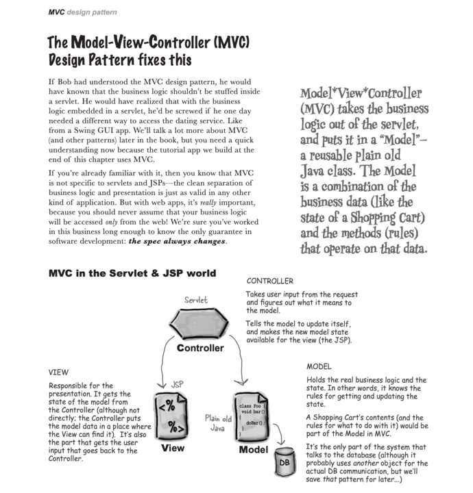

## 特殊情况
上午：暴雨 + 内涝

## Practice & Answer questions

### 功能需求
- 1. 同时支持JDBC和MyBatis两种方式操作数据库【抽象它】
- 2. 增加【用户搜索】和【批量删除】的功能，两种实现方式都要能够支持新增加的功能
- 3. 验证码同时支持图片验证码和邮件发送接收验证码

注意：按顺序实现，前一个实现了，再做下一个

### 目的
- 代码训练
- 思考系统的架构
- 抽象的能力
- 应对需求变更的能力
- 提升系统的可扩展、可维护性

### MVC
